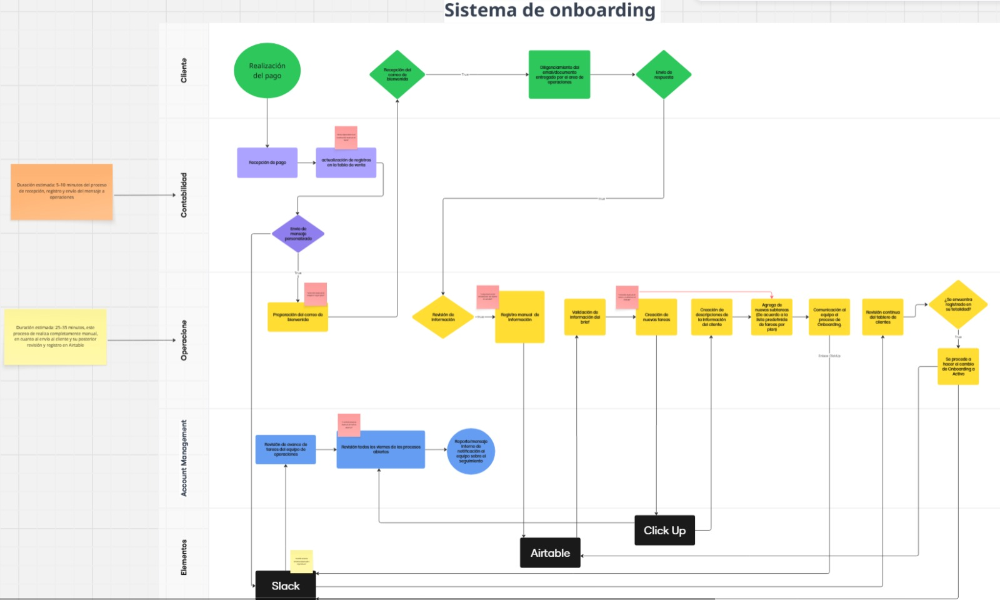

# 🚀 Tech AI Commerce

> Automatización inteligente del proceso de onboarding de clientes mediante n8n e integraciones empresariales.

## 📌 Descripción del proyecto

Tech AI Commerce es una solución de automatización diseñada para transformar el proceso de incorporación de nuevos clientes en una agencia de marketing digital.

El flujo inicia automáticamente cuando un cliente completa su formulario de onboarding, procesa la información recibida, identifica el plan contratado, registra los datos en Airtable, genera tareas y subtareas en ClickUp y notifica al equipo mediante Slack, eliminando tareas manuales y estandarizando el proceso operativo.

---

## 🎯 Problema de negocio

Antes de la automatización, el proceso de onboarding requería que diferentes miembros del equipo realizaran manualmente actividades como:

- Registrar la información del cliente.
- Clasificar el plan contratado.
- Crear tareas operativas.
- Asignar actividades al equipo.
- Notificar el inicio del proyecto.

Este proceso generaba retrasos, reprocesos y riesgo de errores humanos.

---

## ✅ Solución implementada

Se desarrolló un flujo automatizado en **n8n** que centraliza todo el proceso de incorporación del cliente.

La solución permite:

- Recibir automáticamente la información enviada desde Tally.
- Normalizar y transformar los datos mediante JavaScript.
- Clasificar automáticamente el cliente según su plan (Starter, Growth o Premium).
- Registrar la información en Airtable.
- Crear tareas y subtareas en ClickUp.
- Notificar automáticamente al equipo mediante Slack.
- Mantener un flujo completamente automatizado desde el formulario hasta la gestión operativa.

---

## ⚙️ Tecnologías utilizadas

- n8n
- JavaScript
- Airtable API
- ClickUp API
- Slack API
- Webhooks
- Tally Forms

---

## 🔄 Flujo de automatización

```text
Cliente
      │
      ▼
Tally Form
      │
      ▼
Webhook (n8n)
      │
      ▼
Procesamiento de datos
      │
      ▼
Clasificación del plan
      │
      ├── Starter
      ├── Growth
      └── Premium
             │
             ▼
Registro en Airtable
             │
             ▼
Creación de tareas en ClickUp
             │
             ▼
Notificación automática en Slack
```

---

## 🏗️ Arquitectura del proceso



---

## 📂 Estructura del repositorio

```text
tech-ai-commerce/
│
├── docs/
│   └── Documentación del proyecto
│
├── images/
│   └── Diagrama de arquitectura
│
├── workflows/
│   └── Workflow de n8n
│
└── README.md
```

---

## 💡 Habilidades demostradas

- Diseño de procesos de automatización.
- Integración de APIs REST.
- Automatización de procesos empresariales.
- Desarrollo de flujos en n8n.
- Transformación de datos con JavaScript.
- Integración entre múltiples plataformas SaaS.
- Modelado de procesos de negocio.
- Automatización orientada a operaciones.

---

## 👨‍💻 Autor

**Jair Baleta**

AI Automation Engineer | Business Process Automation | n8n Developer
